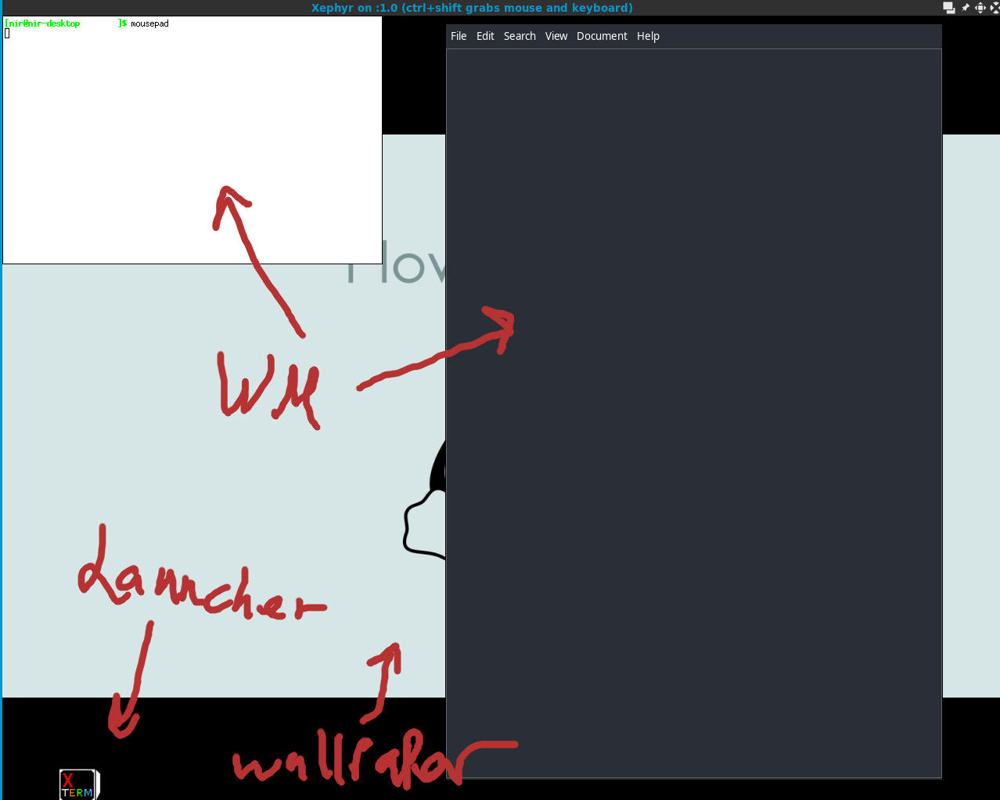

## Cute Desktop Environment

A tiny desktop environment of sorts.
It's mostly a prototype but it's good for learning how a DE works.

Features:
----------
* running compmgr (composite manager)
* simple window manager (based on tinywm)
* simple launcher/task manager (prototype)

Where is the code?
-------------------
If all you want is to browse the code, the CuteWM and CuteLauncher are over here:

* https://github.com/g--o/CuteWM
* https://github.com/g--o/CuteLauncher

NOTE: CuteLauncher is not up to date because newer versions aren't stable in CuteDE

Screenshots
-------------

CuteDE on Xephyr.

How to use:
-------------

* Clone this repo and run the install.sh script to clone both projects and install pre-requisites (This won't copy itself anywhere else so clone it where you want it).
* Default input bindings:
	- Mod key = Alt
	- Mod+Enter: open new terminal
	- Mod+RightClick: resize window
	- Mod+LeftClick: move window
	- LeftClick: re-stack or interact normally
	- MouseHover: focus window
* Keys binds are configurable at key_bindings.py
* User Directory: in the ./user directory you can find customizable things like session startup script and wallpaper, all can be changed to the user's content.

Hope this is useful!

Links:
--------------

[Blog post summary of the project](https://pythonfunblog.wordpress.com/2017/10/14/writing-a-desktop-environment-with-python/)

[Tinywm project](http://incise.org/tinywm.html)
